<p align="center">
  
</p>

# CSC311 XOR Classifier

用一个 2-2-1 的 ReLU 网络解决 XOR 问题。下面先给出一组手工构造的解，再让同样结构的网络从随机初始化开始自己训练，并在每一次参数更新后记录 decision boundary。

## 1. 网络权重与偏置设计

假设输入向量为 $`x = \begin{bmatrix} x_1 \\ x_2 \end{bmatrix}`$，其中 $`x_1, x_2 \in \{0, 1\}`$。

**第一层（隐藏层）：**

- 权重矩阵：$`W^{(1)} = \begin{bmatrix} 1 & 1 \\ 1 & 1 \end{bmatrix}`$
- 偏置向量：$`b^{(1)} = \begin{bmatrix} 0 \\ -1 \end{bmatrix}`$
- 激活函数使用 ReLU：$`h = \max(0, W^{(1)}x + b^{(1)})`$

**第二层（输出层）：**

- 权重向量：$`W^{(2)} = \begin{bmatrix} 1 & -2 \end{bmatrix}`$
- 偏置标量：$`b^{(2)} = 0`$
- 输出计算（不使用激活函数）：$`y = W^{(2)}h + b^{(2)}`$

## 2. 逐步推导计算

我们将 XOR 的四种输入情况代入上述网络，观察隐藏层 $`h`$ 的输出以及最终结果 $`y`$：

| 输入 $`x`$ | 预激活值 $`z^{(1)} = W^{(1)}x + b^{(1)}`$ | 隐藏层激活值 $`h = \mathrm{ReLU}(z^{(1)})`$ | 最终输出 $`y = W^{(2)}h`$ | XOR 真实标签 |
| :---: | :---: | :---: | :---: | :---: |
| $`\begin{bmatrix} 0 \\ 0 \end{bmatrix}`$ | $`\begin{bmatrix} 0 \\ -1 \end{bmatrix}`$ | $`\begin{bmatrix} 0 \\ 0 \end{bmatrix}`$ | $`1(0) - 2(0) = \mathbf{0}`$ | 0 |
| $`\begin{bmatrix} 0 \\ 1 \end{bmatrix}`$ | $`\begin{bmatrix} 1 \\ 0 \end{bmatrix}`$ | $`\begin{bmatrix} 1 \\ 0 \end{bmatrix}`$ | $`1(1) - 2(0) = \mathbf{1}`$ | 1 |
| $`\begin{bmatrix} 1 \\ 0 \end{bmatrix}`$ | $`\begin{bmatrix} 1 \\ 0 \end{bmatrix}`$ | $`\begin{bmatrix} 1 \\ 0 \end{bmatrix}`$ | $`1(1) - 2(0) = \mathbf{1}`$ | 1 |
| $`\begin{bmatrix} 1 \\ 1 \end{bmatrix}`$ | $`\begin{bmatrix} 2 \\ 1 \end{bmatrix}`$ | $`\begin{bmatrix} 2 \\ 1 \end{bmatrix}`$ | $`1(2) - 2(1) = \mathbf{0}`$ | 0 |

## 3. 几何直觉解释

在这个过程中，隐藏层实际上完成了一次空间扭曲（坐标变换）：

在原始的 $`x`$ 二维空间中，点 $`(0,0)`$ 和 $`(1,1)`$ 属于类别 0，而 $`(0,1)`$ 和 $`(1,0)`$ 属于类别 1。由于这两类点交叉分布，你无法画出一条直线将它们分开。

经过带有 ReLU 的隐藏层映射后，原始的四个点在 $`h`$ 空间中被折叠成了三个点：

- $`(0,0) \rightarrow (0,0)`$
- $`(1,0)`$ 和 $`(0,1)`$ 重合到了 $`\rightarrow (1,0)`$
- $`(1,1) \rightarrow (2,1)`$

在这个新的 $`h`$ 特征空间中，属于类别 1 的点 $`(1,0)`$ 与属于类别 0 的点 $`(0,0)`$ 和 $`(2,1)`$ 已经完全被分开了。此时，输出层只需要应用一个简单的线性变换（即一条直线）即可完美区分这三个点。

## 4. 让模型自己训练

`model.py` 搭建了和上面完全相同的结构（2 个输入 → 2 个 ReLU 隐藏单元 → 1 个线性输出），但**不预设任何权重**：参数使用 PyTorch 默认的随机初始化，然后用 Adam（学习率 0.05）在四个 XOR 样本上做 full-batch 训练，最小化 MSE loss，直到 loss 低于 $`10^{-4}`$ 为止。

```bash
pip install torch matplotlib numpy pillow
python3 main.py            # 默认 seed 8
python3 main.py --seed 3   # 换一个随机初始化
```

代码按职责拆成了几个文件，最后在 `main.py` 里组装：

| 文件 | 职责 |
| :--- | :--- |
| `data.py` | 生成 XOR 的四个样本 |
| `model.py` | 定义 2-2-1 的 ReLU 网络 |
| `train.py` | 训练循环，每次更新后通过回调把 step 和 loss 交给调用方 |
| `plot.py` | 画 decision boundary 快照、合成 GIF |
| `main.py` | 解析参数，把上面几部分组装起来并打印结果 |

默认 seed 下训练在 134 次更新后停止（loss $`\approx 6.5 \times 10^{-5}`$），学到的参数是：

```math
W^{(1)} = \begin{bmatrix} 1.0577 & 1.0687 \\ 1.1794 & 1.1891 \end{bmatrix}, \quad
b^{(1)} = \begin{bmatrix} -0.0513 \\ -1.1115 \end{bmatrix}, \quad
W^{(2)} = \begin{bmatrix} 1.1364 & -1.8602 \end{bmatrix}, \quad
b^{(2)} = -0.0148
```

| 输入 $`x`$ | 隐藏层激活值 $`h`$ | 模型输出 $`y`$ | XOR 真实标签 |
| :---: | :---: | :---: | :---: |
| $`(0, 0)`$ | $`(0, 0)`$ | $`-0.0148`$ | 0 |
| $`(0, 1)`$ | $`(1.0174, 0.0776)`$ | $`0.9971`$ | 1 |
| $`(1, 0)`$ | $`(1.0064, 0.0679)`$ | $`1.0027`$ | 1 |
| $`(1, 1)`$ | $`(2.0751, 1.2570)`$ | $`0.0052`$ | 0 |

模型自己找到的解和第 1 节手工构造的解几乎一样：两个隐藏单元都在计算 $`x_1 + x_2`$，其中一个的偏置接近 $`0`$、另一个接近 $`-1`$，输出层再用大约 $`1`$ 和 $`-2`$ 的权重把它们组合起来。

> **注意：** 只有 2 个隐藏单元的 ReLU 网络很容易卡在局部最优（例如某个 ReLU 单元对所有输入都输出 0）。在 seed 0–9 中，只有 seed 8 收敛到了正确解，其余 9 个都停在 loss 0.1667 或 0.25。默认 seed 选 8 就是这个原因——权重本身仍然是随机初始化、由训练得到的。

## 5. Decision boundary 的演化

图中的颜色是模型输出 $`y`$ 的大小（蓝色偏 0，红色偏 1），黑线是 $`y = 0.5`$ 的 decision boundary。每一次参数更新后都会保存一张图到 `image/steps/`，最后一张同时保存为 `image/final.png`（也就是本页顶部的图）。

<p align="center">
  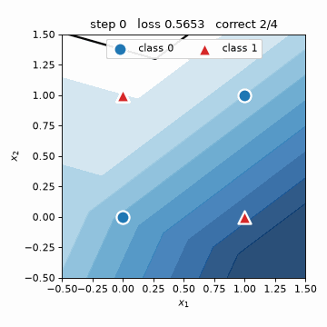
</p>

全部 135 张快照（step 0 是随机初始化，step 134 是最终结果）：

<table>
<tr><td align="center">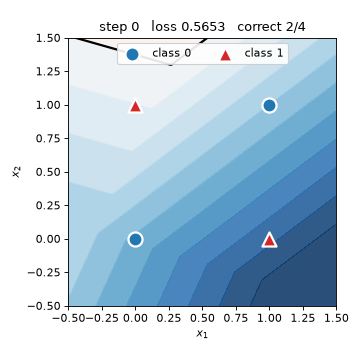<br><sub>step 0</sub></td><td align="center">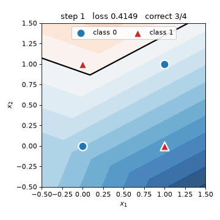<br><sub>step 1</sub></td><td align="center">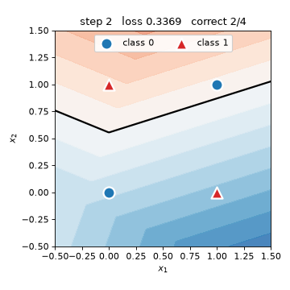<br><sub>step 2</sub></td><td align="center">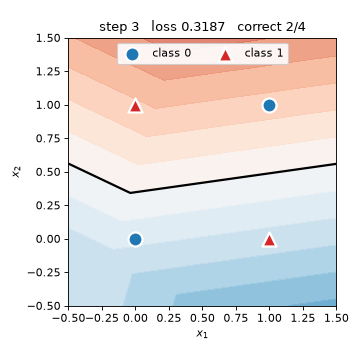<br><sub>step 3</sub></td><td align="center">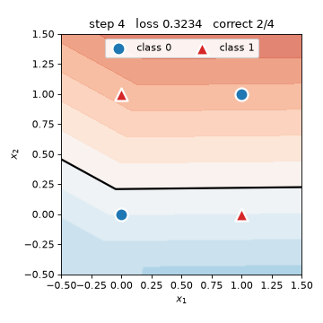<br><sub>step 4</sub></td></tr>
<tr><td align="center">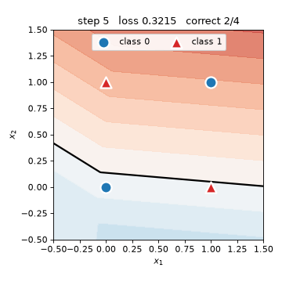<br><sub>step 5</sub></td><td align="center">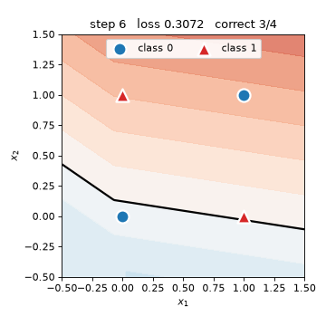<br><sub>step 6</sub></td><td align="center">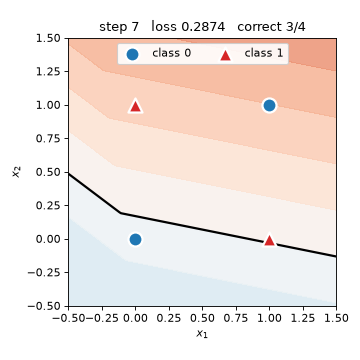<br><sub>step 7</sub></td><td align="center">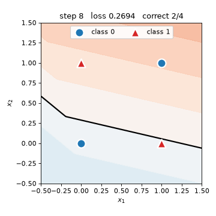<br><sub>step 8</sub></td><td align="center">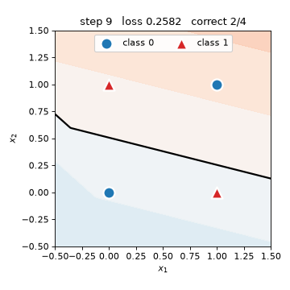<br><sub>step 9</sub></td></tr>
<tr><td align="center">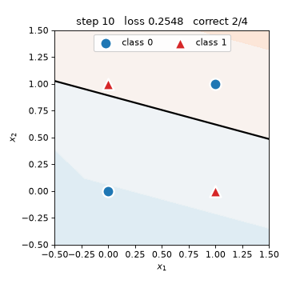<br><sub>step 10</sub></td><td align="center">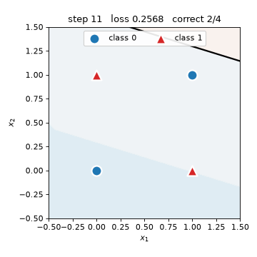<br><sub>step 11</sub></td><td align="center">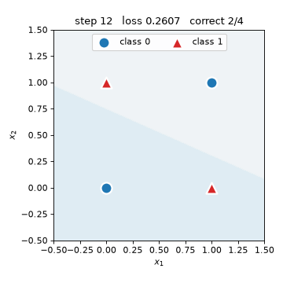<br><sub>step 12</sub></td><td align="center">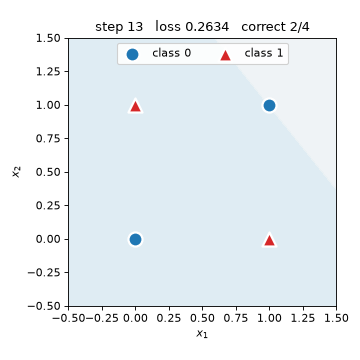<br><sub>step 13</sub></td><td align="center">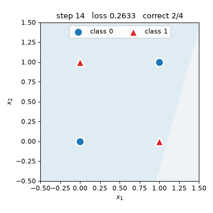<br><sub>step 14</sub></td></tr>
<tr><td align="center">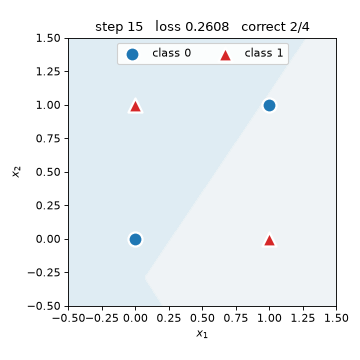<br><sub>step 15</sub></td><td align="center">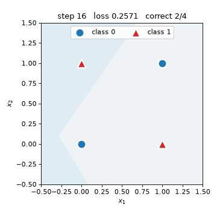<br><sub>step 16</sub></td><td align="center">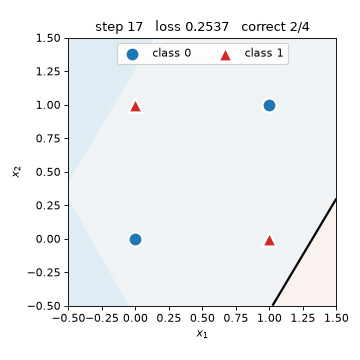<br><sub>step 17</sub></td><td align="center">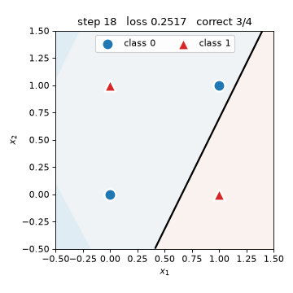<br><sub>step 18</sub></td><td align="center">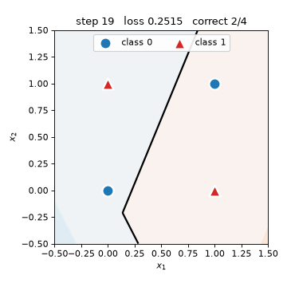<br><sub>step 19</sub></td></tr>
<tr><td align="center">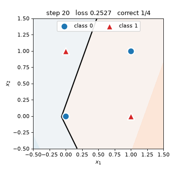<br><sub>step 20</sub></td><td align="center">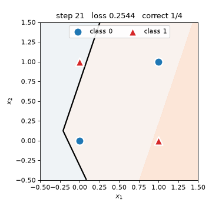<br><sub>step 21</sub></td><td align="center"><br><sub>step 22</sub></td><td align="center">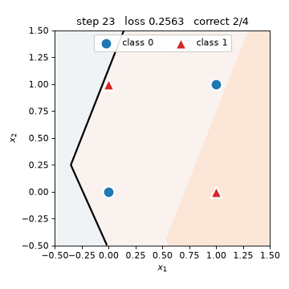<br><sub>step 23</sub></td><td align="center">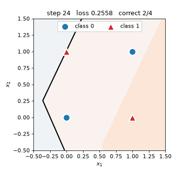<br><sub>step 24</sub></td></tr>
<tr><td align="center">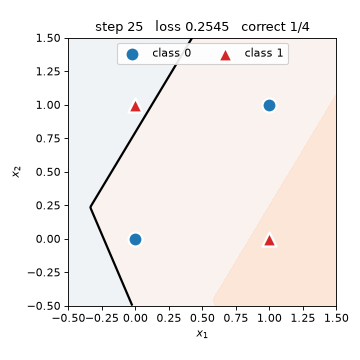<br><sub>step 25</sub></td><td align="center">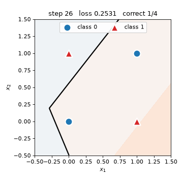<br><sub>step 26</sub></td><td align="center">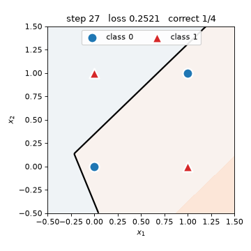<br><sub>step 27</sub></td><td align="center">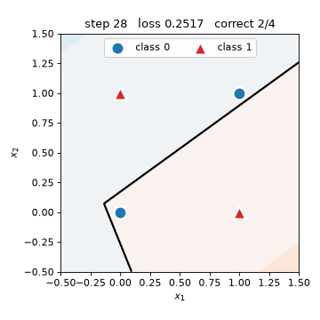<br><sub>step 28</sub></td><td align="center">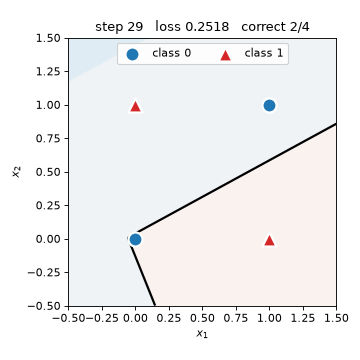<br><sub>step 29</sub></td></tr>
<tr><td align="center">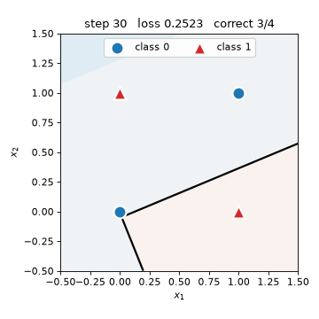<br><sub>step 30</sub></td><td align="center">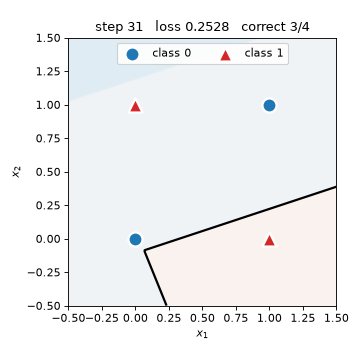<br><sub>step 31</sub></td><td align="center">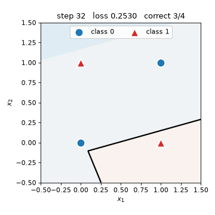<br><sub>step 32</sub></td><td align="center"><br><sub>step 33</sub></td><td align="center">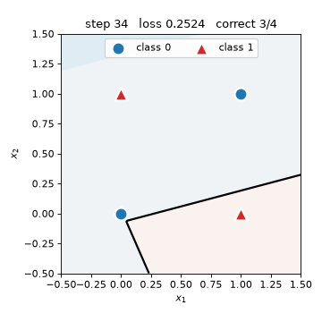<br><sub>step 34</sub></td></tr>
<tr><td align="center">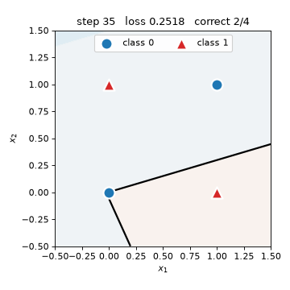<br><sub>step 35</sub></td><td align="center">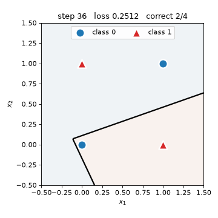<br><sub>step 36</sub></td><td align="center">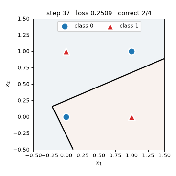<br><sub>step 37</sub></td><td align="center">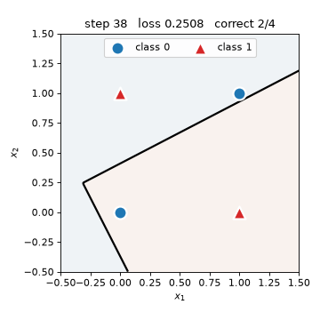<br><sub>step 38</sub></td><td align="center">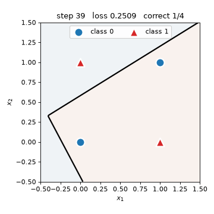<br><sub>step 39</sub></td></tr>
<tr><td align="center">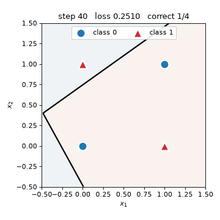<br><sub>step 40</sub></td><td align="center">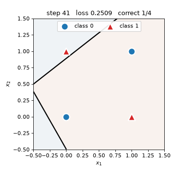<br><sub>step 41</sub></td><td align="center">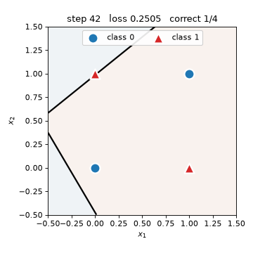<br><sub>step 42</sub></td><td align="center">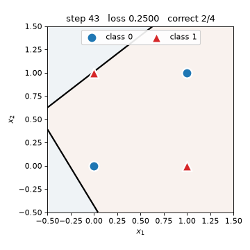<br><sub>step 43</sub></td><td align="center">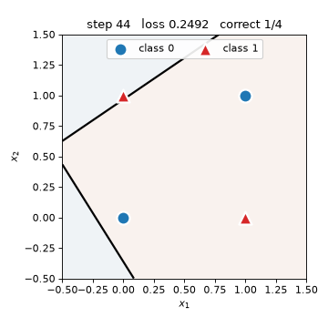<br><sub>step 44</sub></td></tr>
<tr><td align="center">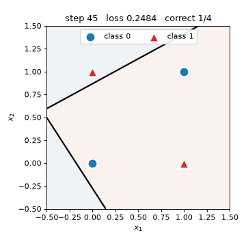<br><sub>step 45</sub></td><td align="center">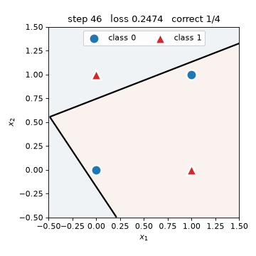<br><sub>step 46</sub></td><td align="center">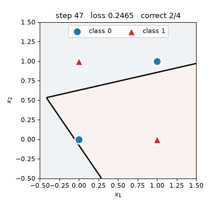<br><sub>step 47</sub></td><td align="center">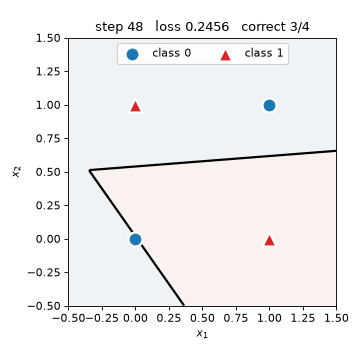<br><sub>step 48</sub></td><td align="center">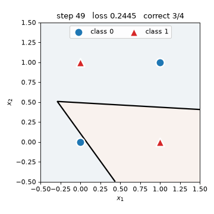<br><sub>step 49</sub></td></tr>
<tr><td align="center">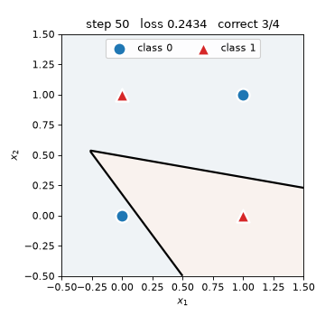<br><sub>step 50</sub></td><td align="center"><br><sub>step 51</sub></td><td align="center"><br><sub>step 52</sub></td><td align="center"><br><sub>step 53</sub></td><td align="center"><br><sub>step 54</sub></td></tr>
<tr><td align="center"><br><sub>step 55</sub></td><td align="center"><br><sub>step 56</sub></td><td align="center"><br><sub>step 57</sub></td><td align="center"><br><sub>step 58</sub></td><td align="center"><br><sub>step 59</sub></td></tr>
<tr><td align="center"><br><sub>step 60</sub></td><td align="center"><br><sub>step 61</sub></td><td align="center"><br><sub>step 62</sub></td><td align="center"><br><sub>step 63</sub></td><td align="center"><br><sub>step 64</sub></td></tr>
<tr><td align="center"><br><sub>step 65</sub></td><td align="center"><br><sub>step 66</sub></td><td align="center"><br><sub>step 67</sub></td><td align="center"><br><sub>step 68</sub></td><td align="center"><br><sub>step 69</sub></td></tr>
<tr><td align="center"><br><sub>step 70</sub></td><td align="center"><br><sub>step 71</sub></td><td align="center"><br><sub>step 72</sub></td><td align="center"><br><sub>step 73</sub></td><td align="center"><br><sub>step 74</sub></td></tr>
<tr><td align="center"><br><sub>step 75</sub></td><td align="center"><br><sub>step 76</sub></td><td align="center"><br><sub>step 77</sub></td><td align="center"><br><sub>step 78</sub></td><td align="center"><br><sub>step 79</sub></td></tr>
<tr><td align="center"><br><sub>step 80</sub></td><td align="center"><br><sub>step 81</sub></td><td align="center"><br><sub>step 82</sub></td><td align="center"><br><sub>step 83</sub></td><td align="center"><br><sub>step 84</sub></td></tr>
<tr><td align="center"><br><sub>step 85</sub></td><td align="center"><br><sub>step 86</sub></td><td align="center"><br><sub>step 87</sub></td><td align="center"><br><sub>step 88</sub></td><td align="center"><br><sub>step 89</sub></td></tr>
<tr><td align="center"><br><sub>step 90</sub></td><td align="center"><br><sub>step 91</sub></td><td align="center"><br><sub>step 92</sub></td><td align="center"><br><sub>step 93</sub></td><td align="center"><br><sub>step 94</sub></td></tr>
<tr><td align="center"><br><sub>step 95</sub></td><td align="center"><br><sub>step 96</sub></td><td align="center"><br><sub>step 97</sub></td><td align="center"><br><sub>step 98</sub></td><td align="center"><br><sub>step 99</sub></td></tr>
<tr><td align="center"><br><sub>step 100</sub></td><td align="center"><br><sub>step 101</sub></td><td align="center"><br><sub>step 102</sub></td><td align="center"><br><sub>step 103</sub></td><td align="center"><br><sub>step 104</sub></td></tr>
<tr><td align="center"><br><sub>step 105</sub></td><td align="center"><br><sub>step 106</sub></td><td align="center"><br><sub>step 107</sub></td><td align="center"><br><sub>step 108</sub></td><td align="center"><br><sub>step 109</sub></td></tr>
<tr><td align="center"><br><sub>step 110</sub></td><td align="center"><br><sub>step 111</sub></td><td align="center"><br><sub>step 112</sub></td><td align="center"><br><sub>step 113</sub></td><td align="center"><br><sub>step 114</sub></td></tr>
<tr><td align="center"><br><sub>step 115</sub></td><td align="center"><br><sub>step 116</sub></td><td align="center"><br><sub>step 117</sub></td><td align="center"><br><sub>step 118</sub></td><td align="center"><br><sub>step 119</sub></td></tr>
<tr><td align="center"><br><sub>step 120</sub></td><td align="center"><br><sub>step 121</sub></td><td align="center"><br><sub>step 122</sub></td><td align="center"><br><sub>step 123</sub></td><td align="center"><br><sub>step 124</sub></td></tr>
<tr><td align="center"><br><sub>step 125</sub></td><td align="center"><br><sub>step 126</sub></td><td align="center"><br><sub>step 127</sub></td><td align="center"><br><sub>step 128</sub></td><td align="center"><br><sub>step 129</sub></td></tr>
<tr><td align="center"><br><sub>step 130</sub></td><td align="center"><br><sub>step 131</sub></td><td align="center"><br><sub>step 132</sub></td><td align="center"><br><sub>step 133</sub></td><td align="center"><br><sub>step 134</sub></td></tr>
</table>
